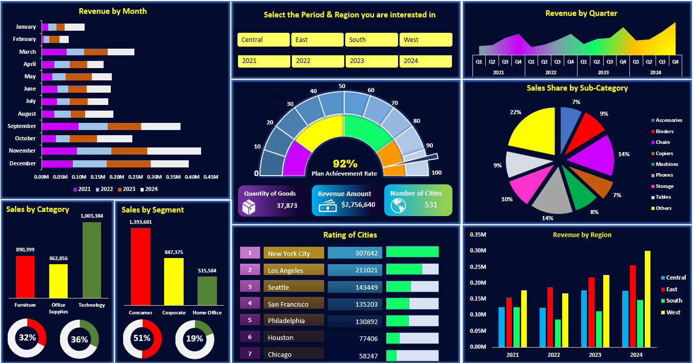

# Excel Dashboard Project – Revenue & Orders Overview

## 📘 Project Overview
This project is an **interactive Excel dashboard** designed to analyze **sales performance, revenue trends, and order distribution**.  
It leverages **Pivot Tables, Charts, and Slicers** to provide actionable insights in a visually appealing format.  

---

## 📊 Features
- **Dynamic Charts & Visuals** – Track revenue, orders, and category-wise performance  
- **Pivot Tables & Slicers** – Filter data by product, region, and time period  
- **Sales Planning Sheet** – Forecast sales and compare planned vs actual performance  
- **Clean & Interactive Layout** – Easy-to-use dashboard for stakeholders  

---

## 🛠 Tools & Technologies
- **Microsoft Excel (.xlsx)**  
- **Pivot Tables & Pivot Charts**  
- **Interactive Slicers**  
- **Conditional Formatting**  
- **Data Analysis Techniques**  

---

## 📂 Project Files
| File Name               | Description                              |
|------------------------|------------------------------------------|
| `Source data.xlsx`     | Main Excel file with dashboard & data    |
| `screenshots/`         | Contains screenshots of the dashboard    |

---

## 📸 Screenshots

### **Dashboard View**

---

## 📈 Key Insights
- **Top-performing regions & products** visualized for better decision-making  
- **Revenue trends** tracked over time for forecasting  
- **Customer & product segmentation** for targeted strategies  

---

## 📋 How to Use
1. **Download** the `Source data.xlsx` file.  
2. **Open in Microsoft Excel** (2016 or later recommended).  
3. Use **slicers & filters** to interact with the data.  
4. Explore the **pivot tables & charts** to gain insights.  

---

## 💼 About This Project
This dashboard was created to **showcase Excel data analysis & visualization skills**.  
It demonstrates the ability to handle raw data, clean & summarize it, and present it in a **professional, decision-friendly format**.